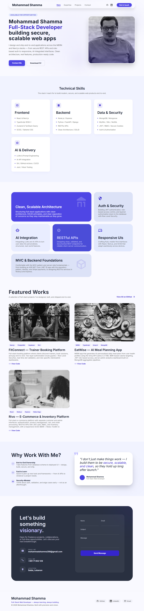

# Mohammad Shamma | Full Stack Developer Portfolio

A professional personal portfolio site built with React, showcasing my background, skills, projects, and professional value as a Full Stack Developer.

---

## 🚀 Live Demo

> Coming soon

---

## 📸 Screenshot

<p align="center">
  
</p>

> ⚠️ Update this screenshot after adding a real profile photo and project images — the current one is from an earlier version of the site.

---

## 📋 Project Overview

This portfolio is a single-page application (SPA) built with React and styled using SCSS with BEM methodology. It presents my technical expertise, featured projects, and contact information in a clean, modern, and fully responsive design.

---

## 🗂 Project Structure

```
public/
├── images/                  # Profile photo and project screenshots
├── icons.svg                # Social icon sprite reference
└── Mohammad_Shamma_CV.pdf   # Downloadable CV (linked from Hero)
src/
├── assets/                  # Bundled images and static files
├── components/
│   ├── header/               # Fixed navigation bar with social icons
│   ├── footer/                # Site footer with social icons
│   ├── icon/                    # Reusable inline-SVG icon component
│   └── project-card/         # Reusable project card component
├── sections/
│   ├── hero/                # Hero / intro section
│   ├── technologies/         # Technical ecosystem (Frontend, Backend, Tools)
│   ├── about/                  # Core expertise bento cards
│   ├── projects/              # Featured works
│   ├── hire-me/                # Why collaborate + quote card
│   └── contact/                # Contact form
├── pages/
│   └── home/                # Home page — assembles all sections
├── styles/
│   └── config.scss          # Global SCSS variables, breakpoints, and mixins
├── App.jsx                  # Root component
├── main.jsx                 # Entry point
└── index.css                # Base reset styles
```

---

## 🛠 Technologies Used

| Category | Technology |
|----------|-----------|
| Framework | React 18 |
| Language | JavaScript (JSX) |
| Styling | SCSS with BEM methodology |
| Fonts | Inter, JetBrains Mono (Google Fonts) |
| Icons | Custom inline SVG icon set (no external font dependency) |
| Build Tool | Vite |
| State Management | React Hooks (useState, useEffect) |
| Routing | None — single page with smooth scroll |

---

## 📦 Prerequisites

Make sure you have the following installed:

- [Node.js](https://nodejs.org/) v18 or higher
- npm v9 or higher

---

## ⚙️ How to Run Locally

**1. Clone the repository**

```bash
git clone https://github.com/mohasham/digital-hub-react-portfolio-project.git
cd digital-hub-react-portfolio-project
```

**2. Install dependencies**

```bash
npm install
```

**3. Start the development server**

```bash
npm run dev
```

**4. Open in browser**

```
http://localhost:5173
```

---

## 🏗 How to Build for Production

```bash
npm run build
```

The output will be in the `dist/` folder, ready to deploy to any static hosting service.

---

## 🌍 Deployment

This project can be deployed to:

- [Vercel](https://vercel.com/) — recommended, connect your GitHub repo and deploy in one click
- [Netlify](https://netlify.com/)
- [GitHub Pages](https://pages.github.com/)

---

## 📱 Responsive Design

The portfolio is fully responsive across all screen sizes:

| Breakpoint | Variable | Target |
|------------|----------|--------|
| 20em (320px) | `$bp-xs` | Very small / old phones |
| 30em (480px) | `$bp-sm` | Small phones |
| 48em (768px) | `$bp-md` | Tablets and up |
| 64em (1024px) | `$bp-lg` | Small desktops |
| 75em (1200px) | `$bp-xl` | Large desktops |

---

## ✨ Features

- Fixed glassmorphism navigation bar with scroll effect and inline social icons
- Animated hero section with floating image
- Technical ecosystem cards (Frontend, Backend, Data & Security, AI & Delivery)
- Core expertise bento grid, including MVC/backend foundations
- Featured projects with hover overlay and clickable GitHub repo links
- Why collaborate section with quote card
- Contact form with controlled React state
- Fully responsive down to 320px
- SCSS BEM methodology throughout
- CSS custom properties for theming
- Self-contained inline SVG icons — no external icon font dependency

---

## 👤 Author

**Mohammad Shamma**
- Email: mohammadshamma298@gmail.com
- GitHub: [github.com/mohasham](https://github.com/mohasham)
- LinkedIn: [linkedin.com/in/mohammad-shamma](https://www.linkedin.com/in/mohammad-shamma/)

---

© 2026 Mohammad Shamma. Built with precision and vision.
